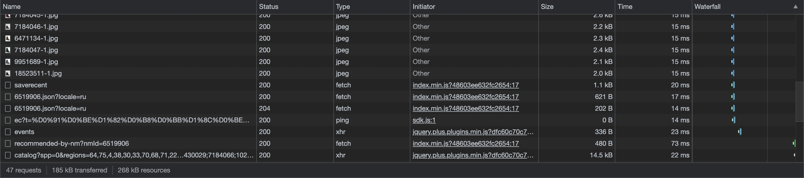

# Wildberries

## 1. Тема и целевая аудитория

### 1.1. Тема
[Wildberries](https://www.wildberries.ru) — международный интернет-магазин одежды, обуви, 
электроники, детских товаров, товаров для дома и других товаров.

### 1.2. Функционал MVP
- Поиск по поисковой строке
- Фильтрация товаров
- Категории товаров
- Корзина (добавление и удаление товаров)
- Оформление заказа
- Просмотр страницы товара
- Просмотр каталога товаров (105 товаров на одной странице по умолчанию)
- Авторизация + регистрация
- Написание отзыва

### 1.3. Целевая аудитория
Аудитория насчитывает 7 млн неуникальных посетителей сайта и приложения в день и примерно 199 млн в месяц, 
а число зарегистрированных пользователей 41 млн [[3]](https://www.similarweb.com/website/wildberries.ru/#websiteMobileApps). 
Количество заказов в день достигает 780 тыс [[6]](https://seller.wildberries.ru/).

#### 1.3.1. Распределение по странам
Основная масса пользователей (~90%) сосредоточена в России.
Можно выделить пять стран, жители которых чаще других посещают Wildberries [[3]](https://www.similarweb.com/website/wildberries.ru/#websiteMobileApps):
- Россия - 91.97%
- Белоруссия - 3.09%
- Украина - 2.05%
- Казахстан - 1.68%
- Армения - 0.20%

#### 1.3.2. Распределение по устройствам
Количество пользователей мобильных приложений и мобильной версии сайта Wildberries постоянно растёт. 
Наиболее стремительный рост был в сентябре 2020 года, тогда в 2.3 раза увеличилось число мобильных 
пользователей до 17.2 млн человек. На данный момент статистика выглядит следующим образом [[9]](https://www.crosssale.ru/sravneniye_pokazateley_marketpleysov):
- Десктоп - 46%
- Мобильные устройства - 53%

#### 1.3.3. Распределние по возрастным группам
Мужчины и женщины в равной степени от 25 до 44 лет являются основоной аудиторией сервиса [[9]](https://www.crosssale.ru/sravneniye_pokazateley_marketpleysov).
Распределение пользователей по возростным группам:
- 18-24 - 17%
- 25-34 - 36%
- 35-44 - 21%
- 45-54 - 16%
- 55-64 - 8%
- 65+ - 4%

## 2. Расчёт нагрузки

### 2.1. Продуктовые метрики

#### 2.1.1. Месячная и дневная аудитория
На данный момент в приложении зарегистрировано 41 млн пользователей.
Как утверждается на официальном сайте, количество постоянных пользователей достигло
отметки в 27 млн человек [[6]](https://seller.wildberries.ru/).

Главным конкурентом wildberries является alliexpress.ru. Аудитория alliexpress.ru за 2020 год: 
>"Продажи локальных российских производителей выросли в 3 раза. Количество ежедневных уникальных пользователей
> мобильной платформы (DAU) выросло на 17% год к году, общая цифра DAU составила более 8,8 млн". 

В 2020 alliexpress.ru впервые опередил wildberries.ru по дневной аудитории. 

Большой интерес представляет статья "Оборот Wildberries в I полугодии" за 2021 год
где написано:
> "Среднее число заказов в сутки возросло с 1,5 млн в начале 2021 г. до 2 млн к июню 2021 г"

Точных данных нет, но использую оценочные суждения и отталкиваюсь от цифры в 6-7 млн посетителей в сутки
предположим, что ежемесячное количество пользователей для Wildberries в России (MAU)
доросло до отметки `18 млн человек`, ежедневное (DAU) — `5,3 млн человек`.

#### 2.1.2. Средний размер хранилища пользователя
Для каждого пользователя сервиса можно выделить следующий набор данных:
1) Профиль (258 КБ)
   - Аватар: в среднем занимает 250 КБ
   - Учётные данные (ФИО + email + телефон): под все поля учётных данных 1000 Байт
   - Реквизиты карт: под одну карту необходимо примерно 400 Байт
   - Метаинформация: 150 Байт
2) Отзыв (615 КБ)
   - Текст отзыва: 300 символов = 300 Байт
   - Фото товара: в среднем одно фото 300 КБ х 2 = 600 КБ
   - Метаинформация: 150 Байт

#### 2.1.3. Среднее количество действий пользователя по типам в день
Пользователь в среднем пользуется 1-3 раза сервисом за день. 
При этом среднее время нахождения пользователя на сайте составляет 12 мин [[3]](https://www.similarweb.com/website/wildberries.ru/#websiteMobileApps).

Рис. 1: среднее время посещения маркетплейсов

Рис. 2: среднее количество страниц сервиса, которое посещает пользователь

При рассмотрении стандартного поведения пользователя пользователя
можно сформировать средние оценки его действий. При этом отметим, что количество 
операций опеределённого типа напрямую зависит от пользовательского сценария, 
в котором используется сервис.

| Действие пользователя      | Количество повторений [min-max (avg)]|
|:-------------------------- |:------------------------------------:|
| Поиск по поисковой строке  | 1-4 (2.5)                            |
| Фильтрация товаров         | 3-11 х 4 (28)                        |
| Категории товаров          | 8-16 (12)                            |
| Корзина                    | 0-4 (2)                              |
| Оформление заказа          | 0-1 (0.5)                            |
| Просмотр страницы товара   | 4-12 (8)                             |
| Просмотр каталога товаров  | 4-8 (6)                              |
| Авторизация + Регистрация  | 0-1 (0.5)                            |
| Написание отзыва           | 0-1 (0.5)                            |

### 2.2. Технические метрики

#### 2.2.1. Размер хранения в разбивке по типам данных (в Тб)
Основые типы данных:
- Изображения
   - Фото товаров: согласно статистики в начале 2020 года асортимент товаров состоял из 6.1 млн уникальных
   наименований, при этом каждый товар в среднем содержит 5 фотографий, при этом размер одного фото в 
   среднем 40 KB. В таком случае хранение всех товаров занимает `40 КБ * 5 * 6100000 = 1,22 Тб`.
   - Аватарки пользователей: в сервисе зарегистрировано 40 млн пользователей, предположим, что у 10%
   есть аватарка и средний размер 250 КБ. В таком случае хранение всех аватарок занимает 
   `250 КБ * 0.1 * 40000000 = 1 Тб`.

#### 2.2.2. Сетевой трафик
Основным типом трафика является получение информации о товарах. При этом можно выделить
два направления: получение полной информации о конкретном товаре и получение
превью информации о группе товаров. Статитические файлы в wildberries хостятся на `https://images.wbstatic.net`.
1) Просмотр страницы товара
   
   Каждый товар в среднем содержит 5 фотографий, при этом размер одного фото 40 KB. В среднем для
   загрузки всей страницы товара (не учитывая рекомендации и похожие товары), которая не просматривались ранее, 
   объём трафика составит 185 КБ.
   То есть `185 КБ * 8 * 2 * 5300000 / 24 / 3600 = 181,574 МБ/с`.
   
   Рис. 4: network при загрузке страницы товаров

3) Просмотр каталога товаров
   
   При просмотре списка товаров нет необходимости загружать все фото для данного товара.
   В таком случае достаточно превью фотографии, которая имеет более маленькое разрешение и размер.
   Средний размер превью фото 30 КБ и по умолчанию на странице представлено 105 товаров. В среднем для
   загрузки всей страницы с товарами, которые не просматривались ранее, объём трафика составит 4 МБ.
   То есть `4 МБ * 6 * 2 * 5300000 / 24 / 3600 = 2,944 ГБ/с`.
   
   Рис. 5: network при загрузке страницы кталога товаров

#### 2.2.3. RPS в разбивке по типам запросов (запросов в секунду)
Пользователь в среднем совершает 51 операцию и за день выходит 102 действия.
То есть в день получается `RPS = 102 * 5300000 / 24 / 3600 = 6257`.

| Запрос                                              | Количество RPS         | Тип запроса |
|:--------------------------------------------------- |:----------------------:| :---------: |
| Поиск по поисковой строке                           | 307                    | чтение      |
| Фильтрация товаров на каждое изменение фильтра      | 3435                   | чтение      |
| Категории товаров + Категории на странице товара    | 2454                   | чтение      |
| Корзина                                             | 245                    | запись      |
| Оформление заказа                                   | 61                     | запись      |
| Просмотр страницы товара                            | 981                    | чтение      |
| Просмотр каталога товаров                           | 736                    | чтение      |
| Авторизация + Регистрация                           | 61                     | запись      |
| Написание отзыва                                    | 61                     | запись      |

## 3. Логическая схема

## 4. Физическая схема

## Используемые источники
- [1] https://www.retail.ru/news/wildberries-predstaviteli-starshego-pokoleniya-stali-delat-pokupki-s-pomoshchyu--5-oktyabrya-2020-198366/
- [2] https://ru.semrush.com/analytics/overview/?q=wildberries.ru&searchType=domain
- [3] https://www.similarweb.com/website/wildberries.ru/#websiteMobileApps
- [4] https://a.pr-cy.ru/wildberries.ru/
- [5] https://plus.rbc.ru/news/5ed749a27a8aa9e928ee3c99
- [6] https://seller.wildberries.ru/
- [7] https://ecomhub.ru/top-100-onlajn-ritejlerov-fizicheskih-tovarov-v-2019-ot-alekseja-petrovskogo/
- [8] https://www.finanz.ru/novosti/aktsii/oborot-wildberries-v-i-polugodii-vyros-na-70percent-do-303-mlrd-rubley-1030660609
- [9] https://www.crosssale.ru/sravneniye_pokazateley_marketpleysov