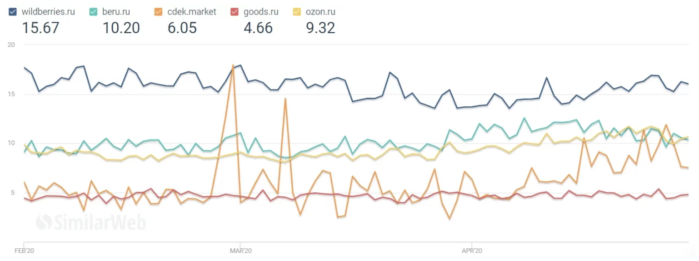

# Wildberries

## 1. Тема и целевая аудитория

### 1.1. Тема
[Wildberries](https://www.wildberries.ru) — международный интернет-магазин одежды, обуви, 
электроники, детских товаров, товаров для дома и других товаров.

### 1.2. Функционал MVP
- Поиск по поисковой строке
- Фильтрация товаров
- Категории товаров
- Корзина (добавление и удаление товаров)
- Оформление заказа
- Просмотр страницы товара
- Просмотр каталога товаров (105 товаров на одной странице по умолчанию)
- Авторизация + регистрация
- Написание отзыва

### 1.3. Целевая аудитория
Аудитория насчитывает 7 млн неуникальных посетителей сайта и приложения в день и примерно 199 млн в месяц, 
а число зарегистрированных пользователей 41 млн [[3]](https://www.similarweb.com/website/wildberries.ru/#websiteMobileApps). 
Количество заказов в день достигает 780 тыс [[6]](https://seller.wildberries.ru/).

#### 1.3.1. Распределение по странам
Основная масса пользователей (~90%) сосредоточена в России.
Можно выделить пять стран, жители которых чаще других посещают Wildberries [[3]](https://www.similarweb.com/website/wildberries.ru/#websiteMobileApps):
- Россия - 91.97%
- Белоруссия - 3.09%
- Украина - 2.05%
- Казахстан - 1.68%
- Армения - 0.20%

#### 1.3.2. Распределение по устройствам
Количество пользователей мобильных приложений и мобильной версии сайта Wildberries постоянно растёт. 
Наиболее стремительный рост был в сентябре 2020 года, тогда в 2.3 раза увеличилось число мобильных 
пользователей до 17.2 млн человек. На данный момент статистика выглядит следующим образом [[9]](https://www.crosssale.ru/sravneniye_pokazateley_marketpleysov):
- Десктоп - 46%
- Мобильные устройства - 53%

#### 1.3.3. Распределние по возрастным группам
Мужчины и женщины в равной степени от 25 до 44 лет являются основоной аудиторией сервиса [[9]](https://www.crosssale.ru/sravneniye_pokazateley_marketpleysov).
Распределение пользователей по возростным группам:
- 18-24 - 17%
- 25-34 - 36%
- 35-44 - 21%
- 45-54 - 16%
- 55-64 - 8%
- 65+ - 4%


## 2. Расчёт нагрузки

### 2.1. Продуктовые метрики


#### 2.1.1. Месячная и дневная аудитория
На данный момент в приложении зарегистрировано 41 млн пользователей.
Как утверждается на официальном сайте, количество постоянных пользователей достигло
отметки в 27 млн человек [[6]](https://seller.wildberries.ru/).

Главным конкурентом wildberries является alliexpress.ru. Аудитория alliexpress.ru за 2020 год: 
>"Продажи локальных российских производителей выросли в 3 раза. Количество ежедневных уникальных пользователей
> мобильной платформы (DAU) выросло на 17% год к году, общая цифра DAU составила более 8,8 млн". 

В 2020 alliexpress.ru впервые опередил wildberries.ru по дневной аудитории. 

Большой интерес представляет статья "Оборот Wildberries в I полугодии" за 2021 год
где написано:
> "Среднее число заказов в сутки возросло с 1,5 млн в начале 2021 г. до 2 млн к июню 2021 г"

Точных данных нет, но использую оценочные суждения и отталкиваюсь от цифры в 6-7 млн посетителей в сутки
предположим, что ежемесячное количество пользователей для Wildberries в России (MAU)
доросло до отметки `18 млн человек`, ежедневное (DAU) — `5,3 млн человек`.

#### 2.1.2. Средний размер хранилища пользователя
Для каждого пользователя сервиса можно выделить следующий набор данных:
1) Профиль (258 КБ)
   - Аватар: в среднем занимает 250 КБ
   - Учётные данные (ФИО + email + телефон): под все поля учётных данных 1000 Байт
   - Реквизиты карт: под одну карту необходимо примерно 400 Байт
   - Метаинформация: 150 Байт
2) Отзыв (615 КБ)
   - Текст отзыва: 300 символов = 300 Байт
   - Фото товара: в среднем одно фото 300 КБ х 2 = 600 КБ
   - Метаинформация: 150 Байт

#### 2.1.3. Среднее количество действий пользователя по типам в день
Пользователь в среднем пользуется 1-3 раза сервисом за день. 
При этом среднее время нахождения пользователя на сайте составляет 12 мин [[3]](https://www.similarweb.com/website/wildberries.ru/#websiteMobileApps).


Рис. 1: среднее время посещения маркетплейсов


Рис. 2: среднее количество страниц сервиса, которое посещает пользователь

При рассмотрении стандартного поведения пользователя пользователя
можно сформировать средние оценки его действий. При этом отметим, что количество 
операций опеределённого типа напрямую зависит от пользовательского сценария, 
в котором используется сервис.

| Действие пользователя      | Количество повторений [min-max (avg)]|
|:-------------------------- |:------------------------------------:|
| Поиск по поисковой строке  | 1-4 (2.5)                            |
| Фильтрация товаров         | 3-11 х 4 (28)                        |
| Категории товаров          | 8-16 (12)                            |
| Корзина                    | 0-4 (2)                              |
| Оформление заказа          | 0-1 (0.5)                            |
| Просмотр страницы товара   | 4-12 (8)                             |
| Просмотр каталога товаров  | 4-8 (6)                              |
| Авторизация + Регистрация  | 0-1 (0.5)                            |
| Написание отзыва           | 0-1 (0.5)                            |


### 2.2. Технические метрики

#### 2.2.1. Размер хранения в разбивке по типам данных (в Тб)
Основые типы данных:
- Изображения
   - Фото товаров: согласно статистики в начале 2020 года асортимент товаров состоял из 6.1 млн уникальных
   наименований, при этом каждый товар в среднем содержит 5 фотографий, при этом размер одного фото в 
   среднем 40 KB. В таком случае хранение всех товаров занимает `40 КБ * 5 * 6100000 = 1,22 Тб`.
   - Аватарки пользователей: в сервисе зарегистрировано 40 млн пользователей, предположим, что у 10%
   есть аватарка и средний размер 250 КБ. В таком случае хранение всех аватарок занимает 
   `250 КБ * 0.1 * 40000000 = 1 Тб`.

#### 2.2.2. Сетевой трафик
Основным типом трафика является получение информации о товарах. При этом можно выделить
два направления: получение полной информации о конкретном товаре и получение
превью информации о группе товаров. Статитические файлы в wildberries хостятся на `https://images.wbstatic.net`.
1) Просмотр страницы товара
   
   Каждый товар в среднем содержит 5 фотографий, при этом размер одного фото 40 KB. В среднем для
   загрузки всей страницы товара (не учитывая рекомендации и похожие товары), которая не просматривались ранее, 
   объём трафика составит 185 КБ.
   То есть `185 КБ * 8 * 2 * 5300000 / 24 / 3600 = 181,574 МБ/с`.
   
   Рис. 4: network при загрузке страницы товаров


3) Просмотр каталога товаров
   
   При просмотре списка товаров нет необходимости загружать все фото для данного товара.
   В таком случае достаточно превью фотографии, которая имеет более маленькое разрешение и размер.
   Средний размер превью фото 30 КБ и по умолчанию на странице представлено 105 товаров. В среднем для
   загрузки всей страницы с товарами, которые не просматривались ранее, объём трафика составит 4 МБ.
   То есть `4 МБ * 6 * 2 * 5300000 / 24 / 3600 = 2,944 ГБ/с`.
   
   Рис. 5: network при загрузке страницы кталога товаров

#### 2.2.3. RPS в разбивке по типам запросов (запросов в секунду)
Пользователь в среднем совершает 51 операцию и за день выходит 102 действия.
То есть в день получается `RPS = 102 * 5300000 / 24 / 3600 = 6257`.

| Запрос                                              | Количество RPS         | Тип запроса |
|:--------------------------------------------------- |:----------------------:| :---------: |
| Поиск по поисковой строке                           | 307                    | чтение      |
| Фильтрация товаров на каждое изменение фильтра      | 3435                   | чтение      |
| Категории товаров + Категории на странице товара    | 2454                   | чтение      |
| Корзина                                             | 245                    | запись      |
| Оформление заказа                                   | 61                     | запись      |
| Просмотр страницы товара                            | 981                    | чтение      |
| Просмотр каталога товаров                           | 736                    | чтение      |
| Авторизация + Регистрация                           | 61                     | запись      |
| Написание отзыва                                    | 61                     | запись      |


## 3. Логическая схема
### 3.1. Список таблиц, полей и связей между ними


### 3.2. Способ хранения категорий
Навигация по маркетплейсу осуществляется в основном за счёт категорий. Поиск по категориям
товаров позволяет находить нужный продукт, если пользователь не знает точного наименования
товара. Категории в маркеплейсе создаются продовцами и дерево категорий может очень быстро разрастаться
в глубину, поэтому важно выбирать оптимальную схему хранения категорий.

#### 3.2.1. Основные способы хранения деревьев в РСУБД:
1. Список смежности (Adjacency List)
   
2. Подмножества (Subsets)
   
3. Вложенные множества (Nested sets)
   
4. Материализованные пути (Materialized paths)
   

#### 3.2.2. Сравнение способов хранения категорий
|    | Список смежности | Подмножества | Вложенные множества | Материализованные пути |
|:------ |:-------:| :-------: | :-------: | :-------: |
| Влияние размера дерева на скорость поиска поддеревьев | сильное: каждый новый уровень вложенности - это +1 SELECT | слабое  | слабое, можно добавить индексы на left_key и right_key | сильное (поиск по подстроке). Использование модуля ltree может ускорить операции так как поддерживает несколько типов индексов (B-дерево и GiST по значениям ltree) |
| Вставка узла | простая: не требует изменения других записей  | сложная: вставка нового узла в обе таблицы + добавление записей для каждого дочернего узла | сложная: обновление всех узлов “правее и ниже” | сложная: обновление всех дочерних узлов |
| Перемещение узла | простое: не требует изменения других записей | сложная: обновление записей для предков и потомков узла | сложная: обновление всех узлов “правее и ниже” | сложная: обновление дочерних узлов и предков |
| Удаление узла | простое, каскадное | простое, каскадное | простое | сложное, поиск по подстроке |
| Избыточность хранения | нет | да | да | да |
| Поддержка целостности данных кроме ссылочной | не нужна | нужна | нужна | нужна |

Из четырех методов только у списка смежности нет избыточности, нет необходимости
в дополнительной поддержке целостности (кроме ссылочной); вставка и перемещение
узлов дерева не затрагивают другие записи в таблице. Однако большинство типовых
запросов для списка смежности используют рекурсию.

Для всех остальных рассмотренных способов рекурсия в запросах не требуется,
но вставка и перемещение узлов не могут быть выполнены без обновления других,
связанных с ними, узлов. Для способов хранения с помощью материализованных путей
и вложенных множеств можно применить оптимизацию, хотя она и не убирает всех
ограничений этих методов.

#### 3.2.3. Выбор способа хранения категорий
Из представленных методов наиболее подходящим для задачи хранения категорий являются 
вложенные множества (Nested sets), поскольку позволяют не использовать рекурсию, быстро 
восстанавливать пути категорий и одинаково быстро выбирать товары для любого узла дерева категорий.

Выборка поддерева по заданному узлу:
```sql
WITH root AS (SELECT left_key, right_key FROM goods_category WHERE code=2 /*код узла*/)
SELECT * FROM goods_category
WHERE left_key >= (SELECT left_key FROM root)
AND right_key <= (SELECT right_key FROM root)
ORDER BY level;
```

Путь к узлу от корня:
```sql
WITH node AS (SELECT left_key, right_key FROM goods_category WHERE code=8 /*код узла*/)
SELECT * FROM goods_category
    WHERE left_key <= (SELECT left_key FROM node) 
        AND right_key >= (SELECT right_key FROM node)
ORDER BY level;
```

Основная сложность этого способа - необходимость переопределения порядка обхода 
при добавлении нового или перемещении существующего узла. Так, если добавить новый 
элемент в самый нижний уровень, то придется обновить поля `left_key` и `right_key` у 
всех узлов, которые находится “правее” и ”выше”, что, фактически, означает 
пересчет всего маршрута по дереву. Можно сократить количество обновлений 
маршрута обхода, если нумеровать left_key и right_key с некоторым интервалом, 
например, вместо “1” и “20” “10 000” и “200 000” соответственно. Это позволит 
вставить новый узел без полной перенумерации всех последующих. Аналогичным 
образом можно использовать в качестве `left_key` и `right_key` дробные числа.

## 4. Физическая схема
Все данные будем хранить с помощью СУБД PostgreSQL, как наиболее функциональной и надежной РСУБД.

### 4.1. Товары
Согласно статистики в начале 2020 года асортимент товаров состоял из 6.1 млн уникальных наименований.
Целесообразно шардировать товары по разным инстансам. Для этого их необходимо поделить на равные по 
размеру группы. Все товары разделяются на категории, именно этот критерий можно использовать для
формирования групп.

Таким образом можно выделить 6 глобальных категорий:
1. Одежда и обувь 
2. Электроника и бытовая техника
3. Товары для детей и игрушки
4. Товары для дома
5. Спорт 
6. Прочее

Самыми сложными запросами являются запросы на выборку товаров по категориям и фильтрам. 
Данных запросов достаточно много: 
- запросов на выборку по категориям - 2454 RPS
- выборка товаров по фильтрам - 3435 RPS

Поэтому необходимо также масштабировать БД, поэтому воспользуемся master-slave репликацией.

Если предположить, что БД способна выдержать в среднем 600 RPS для поиска по категориям и 800 RPS для поиска
по фильтрам. То для каждой категории товаров необходимо создать еще 3 реплики, которые будут использоваться 
только для поиска товаров по разным категориям и фильтрам.

При этом изображения занимают большую часть хранилища товаров. Поэтому, все изображения нужно хранить в 
специализированном хранилище - Amazon S3. Это хранилище предназначено для хранения большого количества 
данных и позволяет делать это дёшево.

### 4.2. Профили пользователей
Профиль пользователя состоит из текстовых данных и аватара. Изображение занимает большую часть 
памяти. Поэтому, все изображения нужно хранить в специализированном хранилище - Amazon S3. 
Это хранилище предназначено для хранения большого количества данных и позволяет делать это дёшево.

### 4.3. Сессии пользователей
Для хранения пользовательских сессий будем использовать key-value хранилище - Redis.

### 4.4. Физическая схема 


## Используемые источники
- [1] https://www.retail.ru/news/wildberries-predstaviteli-starshego-pokoleniya-stali-delat-pokupki-s-pomoshchyu--5-oktyabrya-2020-198366/
- [2] https://ru.semrush.com/analytics/overview/?q=wildberries.ru&searchType=domain
- [3] https://www.similarweb.com/website/wildberries.ru/#websiteMobileApps
- [4] https://a.pr-cy.ru/wildberries.ru/
- [5] https://plus.rbc.ru/news/5ed749a27a8aa9e928ee3c99
- [6] https://seller.wildberries.ru/
- [7] https://ecomhub.ru/top-100-onlajn-ritejlerov-fizicheskih-tovarov-v-2019-ot-alekseja-petrovskogo/
- [8] https://www.finanz.ru/novosti/aktsii/oborot-wildberries-v-i-polugodii-vyros-na-70percent-do-303-mlrd-rubley-1030660609
- [9] https://www.crosssale.ru/sravneniye_pokazateley_marketpleysov